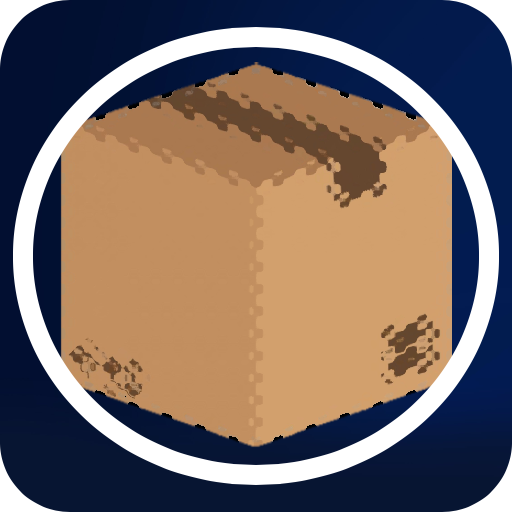
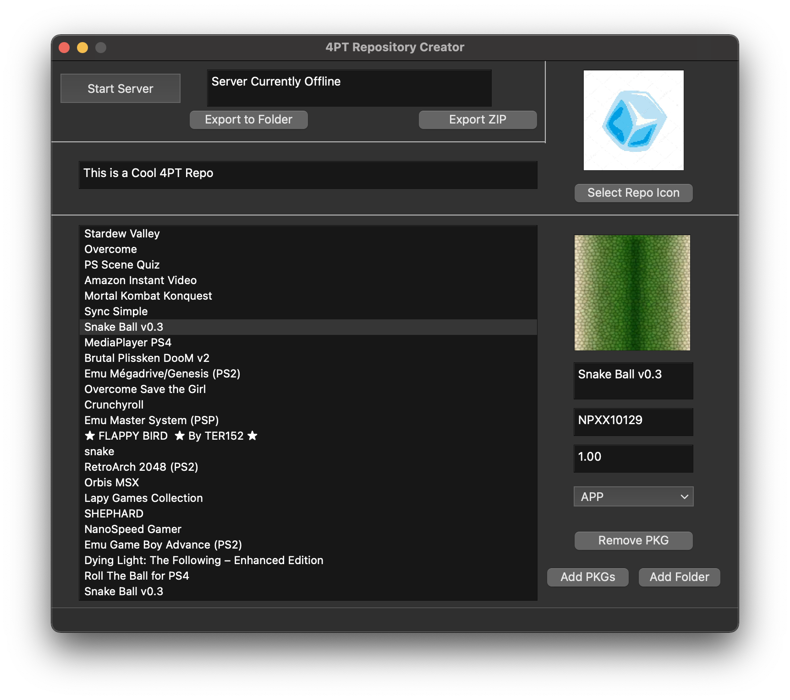

<!-- PROJECT LOGO -->
 

  

<h3 align="center">4PT Repository GUI</h3>

  

    A GUI to create 4PT Repositories
     
    <a href="https://github.com/victorrjimenezz/4PT-Repository/issues"><strong>Request Feature / Report Bug</strong></a>
     
     
    <a href="https://www.4pt-project.com">Website</a>
    .
    <a href="https://github.com/victorrjimenezz/PS4-4PT">The 4PT APP</a>
    ·
    <a href="https://github.com/victorrjimenezz/4PT-Repository">4PT Template Repository</a>
    ·
    <a href="https://github.com/victorrjimenezz/4PT-REPO-GUI/blob/master/TUTORIAL.md">GUI tutorial</a>
  

<!-- TABLE OF CONTENTS -->

  
Table of Contents

  <ol>
    <li>
        <a href="#ata">About The Tool</a>
      <ul>
        <li><a href="#ss">Screenshots</a></li>
      </ul>
    </li>
    <li><a href="#feat">Features</a></li>
    <li><a href="#usage">Usage</a></li>
    <li>
      <a href="#todo">TODO</a>
    </li>
    <li><a href="#buildDep">Build Dependencies</a></li>
    <li><a href="#developers">Developers</a></li>
  </ol>

***

## About The GUI

This is a Graphical User Interface to make it easier for 4PT users to create their own repository.  
This allow users to avoid the need to modify YML files, and makes creating a repository as easy as dropping the pkgs and selecting the type.  
The GUI also features a mini HTTP server that allows users to host a repository without the need of a hosting service or an APACHE server.

### Screenshot

  

***

## Features

The current working app features are:

- Adding/Deleting pkgs and changing their types
- Export the repository to a folder or a ZIP file
- Host the repository without the need of an APACHE server or a hosting service

***

## Usage

_For information on how to use the GUI, refer to [Tutorial](https://github.com/victorrjimenezz/4PT-REPO-GUI/blob/master/TUTORIAL.md)_

_For information on repositories, please refer to  [4PT-Repository](https://github.com/victorrjimenezz/4PT-Repository)_

_For information on 4PT, please refer to  [4PT](https://github.com/victorrjimenezz/PS4-4PT)_

***

## TODO

- [ ] Drag and drop repository icon
- [ ] Add task bar icon on windows
- [ ] Edit existing repositories
- [ ] Add Linux support

See the [open issues](https://github.com/victorrjimenezz/PS4-4PT/issues) for a full list of proposed features (and known issues).

***

## Build Dependencies

This project is built using the Open Orbis PS4 Toolchain and the Yaml-CPP library.

* [Zip](https://github.com/kuba--/zip)
* [Yaml-CPP](https://github.com/jbeder/yaml-cpp)

***

## Developers

Víctor Jiménez - [@victorrjimenezz](https://twitter.com/victorrjimenezz) - [victorjimenez@4pt-project.com](mailto:victorjimenez@4pt-project.com)