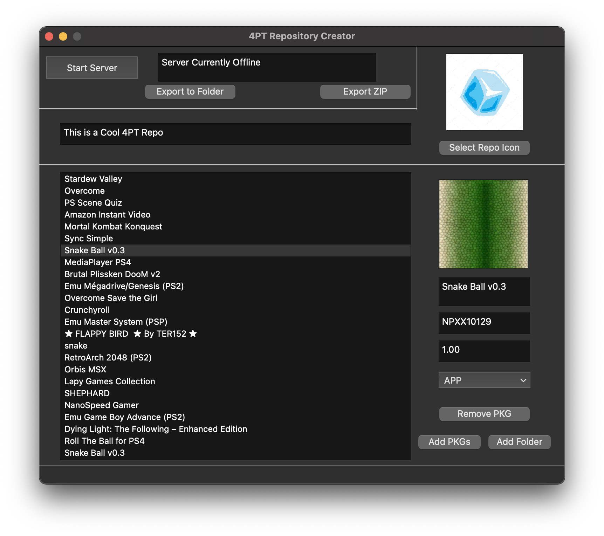

<!-- PROJECT LOGO -->
 

<!-- PROJECT LOGO -->
 

  

<h3 align="center">4PT Repository GUI</h3>

  

    A GUI to create 4PT Repositories
     
    <a href="https://github.com/victorrjimenezz/4PT-Repository/issues"><strong>Request Feature / Report Bug</strong></a>
     
     
    <a href="https://www.4pt-project.com">Website</a>
    .
    <a href="https://github.com/victorrjimenezz/PS4-4PT">The 4PT APP</a>
    ·
    <a href="https://github.com/victorrjimenezz/4PT-Repository">4PT Template Repository</a>
  

<!-- TABLE OF CONTENTS -->

  
Table of Contents

  <ol>
   <li><a href="#rn">Changing the repository name</a></li>
   <li><a href="#ri">Changing the repository icon</a></li>
   <li><a href="#ap">Adding Packages</a></li>
   <li><a href="#rp">Removing Packages</a></li>
   <li><a href="#hr">Hosting a Repository</a></li>
   <li><a href="#er">Exporting the repository</a></li>
  </ol>

***

## Changing the repository name

  

To change the repository name, set the text on the upper-left side of the app to
the desired name

***

## Changing the repository icon

To change the repository icon, click the `Select Repo Icon` button and
select the desired icon from the computer.

***

## Adding packages

To add packages, you can drag and drop them to the pkg list box, or add them manually by
clicking the `Add PKGs` button.

To add an entire folder full of PKGs, simply drag and drop it to the pkg list box, or add it manually
by clicking the `Add Folder` button. **NOTE: THIS WILL SEARCH RECURSIVELY INSIDE FOLDERS, SO IF THERE ARE SUBFOLDERS
FULL OF PACKAGES, THOSE PACKAGES WILL ALSO BE ADDED**

***

## Removing packages

To remove a package, select it from the PKG list box, and click the del button of the keyboard, or press the remove PKG button

***

## Hosting a repository

  

To host a repository, first set it up as you wish following the previous instructions, then 
press the `Start Server` button. To stop it, press the `Stop Server` button.

***NOTE: When the server has started, the start button should switch to the stop button and
the text field next to it should say Server Running on IP:PORT. Otherwise, the server
initialization has failed and will display the message: Could not start server on IP:PORT***

***

## Exporting a repository

To export a repository, press the export to folder or export to zip button, and select the destination.

**NOTE: This will copy the PKGs to the destination folder or the zip file**